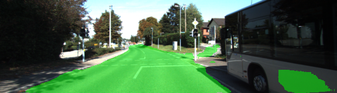
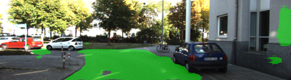
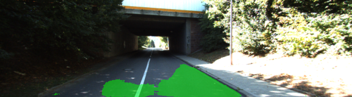
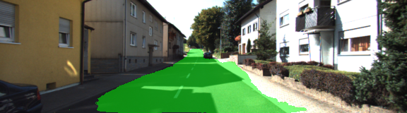

# Semantic Segmentation
Udacity nanodegree Advanced Deep Learning project

## Development System
Nvidia GTX 1080 with 8GB on a quad core i7 with 32GB running Linux Mint.

## Architecture
This project uses Fully Convolutional Network constructed from a vgg16 pretrained model followed by 1x1 convolution filters.  The 1x1 convolutions connect layers 3, 4, and 7 to transposed convolution filters that upsample the classifier outputs to enable pixel-level prediction, in this case whether a pixel is or is not road.  While the specific settings are tuned for this project, the method follows that described by Long, Shelhamer, and Darrell in *Fully Convolutional Networks for Semantic Segmentation.*

## Examples of Segmentation
As shown in the following images, where green marks the predicted road surface, the trained network's inference can be quite good.  However, as shown in the following section, performance is not always this good.

###Urban Marked

###Urban Multiple Marked

###Urban Unmarked

## Observations
Running the same configuration twice can produce considerably different results in some cases.  The image below is um_000092 from the latest run.  Following is the same image from the previous run.  In both cases, the networks were trained for 250 epochs on an augmented data set of 1156 images.  In some cases a shorter training session produces better results on some images than a longer run with the same configuration.  *Note that the longer run is not a continuation of the shorter run.*

Latest network, 250 epochs

Prior network, 250 epochs

### Epochs do not always improve prediction
250 epochs

100 epochs

